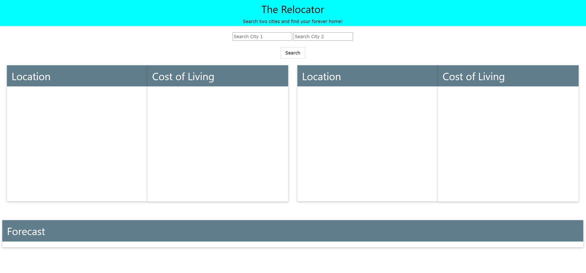
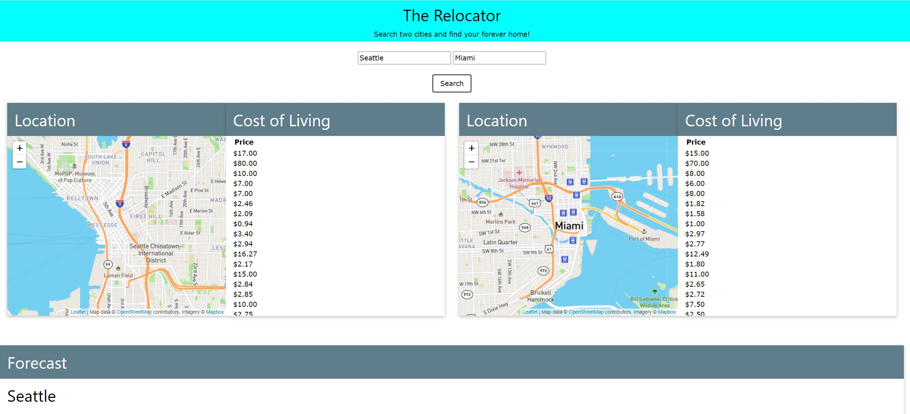
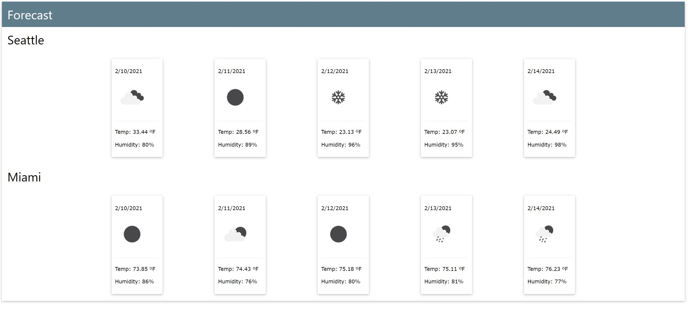

# Group-Project-One

## Project Description

The Relocator is an app for users that want to compare two cities. The app then shows their location, cost of living, and weather data. The Relocator also stores previous user searches for later use. 

## Process

We started thinking about how there really isn’t an effective way to compare cost of living between two places. After a bit of brainstorming that morphed into why you would be comparing cost of living in the first place, moving. From there we brainstormed what other parts of a city are important to compare when you’re considering a move.

This led to us searching for APIs to fit our needs. Since we recently had experience using the Open Weather API, we chose that for weather. We then used Leaflet and the Google Maps API to format our map of each location. What started as just a gas price API search turned into us finding the API Numbeo that pulled a variety of statistics for cost of living.

We chose to use the W3 CSS framework since we already like the readability of the W3 Schools documentation. Jon worked on setting up the initial HTML and CSS of the site. Corbin worked on local storage. Hancong worked on the map API and Leaflet. Haram looked for our cost of living API, found Numbeo, and set up the JavaScript for that. Mike worked on the Open Weather API, error modal, and organizing GitHub.

Some struggles we ran into involved getting the website mobile responsive. The challenge came from getting the W3 Framework to work together with media queries. There was also a big problem with our Open Weather API loop. The loop was finishing before we managed to print the content. We had to set up a promise to finish rendering the content before the next loop started.

## Project Link

[Deployed Link](https://mikecoletta.github.io/Group-Project-One/)

## Screenshots

## Credits

W3 CSS Framework (https://www.w3schools.com/w3css/)

W3 Schools - Modals (https://www.w3schools.com/howto/howto_css_modals.asp)

Open Weather API (https://openweathermap.org/api)

Numbeo API (https://www.numbeo.com/api/doc.jsp)

OpenStreetMap (https://www.openstreetmap.org/)